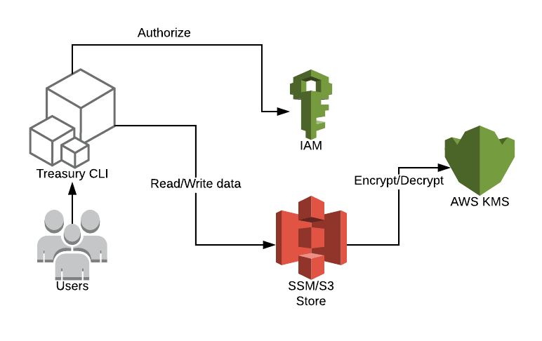

[](https://goreportcard.com/report/github.com/AirHelp/treasury)

# treasury

Treasury is a very simple tool for managing secrets. It uses Amazon S3 or SSM ([Systems Manager Parameter Store](https://docs.aws.amazon.com/systems-manager/latest/userguide/systems-manager-paramstore.html)) service to store secrets. By default, Treasury uses SSM as a backend. The secrets are encrypted before saving them on disks in Amazon data centers and decrypted when being read. Treasury uses Server-Side Encryption with AWS KMS-Managed Keys ([SSE-KMS](http://docs.aws.amazon.com/AmazonS3/latest/dev/UsingKMSEncryption.html)).

- [treasury](#treasury)
  - [Architecture](#architecture)
  - [Command Line interface (CLI)](#command-line-interface-cli)
  - [Configuration](#configuration)
    - [AWS Credentials](#aws-credentials)
    - [SSM store configuration](#ssm-store-configuration)
    - [S3 store configuration](#s3-store-configuration)
    - [AWS Region configuration](#aws-region-configuration)
  - [Installation](#installation)
  - [CLI Usage](#cli-usage)
    - [Write secret](#write-secret)
    - [Write file content](#write-file-content)
    - [Read secret](#read-secret)
    - [List secrets](#list-secrets)
    - [Import secrets](#import-secrets)
    - [Export secrets](#export-secrets)
    - [Teamplate usage](#teamplate-usage)
      - [Template usage with string append to secret value](#template-usage-with-string-append-to-secret-value)
      - [Template usage with variables interpolation](#template-usage-with-variables-interpolation)
      - [read](#read)
      - [readFromEnv](#readfromenv)
      - [export](#export)
      - [exportFromEnv](#exportfromenv)
      - [exportMap](#exportmap)
  - [Setting up the infrastructure](#setting-up-the-infrastructure)
    - [IAM Policy for S3 store](#iam-policy-for-s3-store)
    - [IAM Policy for SSM Store](#iam-policy-for-ssm-store)
  - [Treasury as a user vault](#treasury-as-a-user-vault)
  - [Go Client](#go-client)
  - [Development](#development)
  - [Build for development](#build-for-development)
  - [Tests](#tests)

## Architecture



## Command Line interface (CLI)

Treasury is controlled via a very easy to use command-line interface (CLI). Treasury is only a single command-line application: treasury. This application takes a subcommand such as "read", "write", "import" or "export".

The Treasury CLI is a well-behaved command line application. In erroneous cases, a non-zero exit status will be returned. It also responds to -h and --help as you'd most likely expect.

To view a list of the available commands at any time, just run `treasury` with no arguments. To get help for any specific subcommand, run the subcommand with the -h argument.

## Configuration

### AWS Credentials

Before using the Treasury CLI, ensure that you've configured AWS credentials. The best way to configure credentials on your machine is to use the ~/.aws/credentials file, which might look like:

```bash
[default]
aws_access_key_id = AKID1234567890
aws_secret_access_key = MY-SECRET-KEY
```

Alternatively, you can set the following environment variables:

```bash
AWS_ACCESS_KEY_ID=AKID1234567890
AWS_SECRET_ACCESS_KEY=MY-SECRET-KEY
```

You can also use non-default awscli profile:

```
AWS_PROFILE=development treasury read development/webapp/cockpit_api_pass`
```

And non-default awscli profile without default region:

```
AWS_PROFILE=development ./treasury --region eu-west-1 read test/webapp/cockpit_pass`
```

### SSM store configuration

Treasury uses SSM store by default. No additional configuration is required.

### S3 store configuration

In order to use S3 as a store, set TREASURY_S3 environment variable with S3 bucket name.

For example:

```
export TREASURY_S3=ah-dev-treasury-development
```

In order to use SSM as a store, unset previously configured TREASURY_S3 environment variable.

### AWS Region configuration

In addition to the IAM credentials you'll need to specify the AWS region. You can specify the region either with an environment variable (example below), or directly in AWS configuration file `$HOME/.aws/config`. More about configuration [here](https://docs.aws.amazon.com/cli/latest/userguide/cli-config-files.html).

```sh
export AWS_DEFAULT_REGION=eu-west-1
```

## Installation

on OSX:
```
brew tap airhelp/taps git@github.com:AirHelp/homebrew-taps.git
brew update
brew install treasury
```

## CLI Usage

### Write secret
```
> treasury write development/webapp/cockpit_api_pass superSecretPassword
Success! Data written to: development/webapp/cockpit_api_pass
```

Note: if secret value is equal to existing one, write is skipped. `--force` flag can be used to overwrite.

### Write file content
```
> treasury write development/webapp/credentials_yaml <filename> --file
Success! Data written to: development/webapp/credentials_yaml
```

Note: if secret value is equal to existing one, write is skipped. `--force` flag can be used to overwrite. Stored file content in key is gzipped and converted to base64. You can decode it with bash script easily:
```
> treasury read  development/webapp/credentials_yaml | base64 -D | gzip -d > creadentails.yaml
```
or you can handle it with your application. Size limit depends on backend that you are using - for AWS SSM size limit is 4096 bytes (after gzip and base64).


### Read secret
```
> treasury read development/webapp/cockpit_api_pass
superSecretPassword
```

### List secrets
List the secrets set for a path

```
> treasury list development/application/
development/application/app_api_pass
development/application/test
```

### Import secrets
Assuming properties file `./secrets.env` with content:
```bash
ke1=secret1
key2=secret2
```
To import these values into a previously configured store:
```bash
> treasury import development/application/ ./secrets.env
Import successful
```

### Export secrets
Assuming stored secrets pairs on treasury store
```bash
development/webapp/key1 => superSecretPassword1
development/webapp/key2 => superSecretPassword2
```

To see exported values:
```bash
> treasury export development/webapp/
export key1=superSecretPassword1
export key2=superSecretPassword2
```

To export them into shell environment variables:
```bash
eval $(treasury export development/webapp/)
```

### Teamplate usage

Render the template on disk at /tmp/template.tpl to /tmp/result:

```bash
treasury template --src /tmp/template.tpl --dst /tmp/result
```

Treasury parses file in the Go Template format. The input text for a template is UTF-8-encoded text in any format. "Actions"--data evaluations or control structures--are delimited by "{{" and "}}"; all text outside actions is copied to the output unchanged.

#### Template usage with string append to secret value
```bash
treasury template --src /tmp/template.tpl --dst /tmp/result --append key1:v2
```
This command ends up with output file where the value of variable key1 has a string "v2" appended.

#### Template usage with variables interpolation

Example template:

```
APPNAME={{ .AppName }}
API_PASSWORD={{ .ApiPassword }}
```

```bash
treasury template --src /tmp/template.tpl --dst /tmp/result.env --env AppName=test,ApiPassword=qwerty12345
```

Supported actions:

#### read
**DEPRECATED (please use [readFromEnv](#readfromenv))** Returns single value for given key

```
{{ read "ENVIRONMENT/APPLICATION/SECRET_NAME" }}
```

Example:

```
COCKPIT_API_PASSWORD={{ read "production/cockpit/cockpit_api_password" }}
```

#### readFromEnv

Returns single value for given key in specified environment

```
{{ readFromEnv "ENVIRONMENT" "APPLICATION/SECRET_NAME" }}

# example using interpolation:

{{ readFromEnv .Environment "app/API_PASSWORD" }}
```


#### export
**DEPRECATED (please use [exportFromEnv](#exportFromEnv))** Returns all values for a given path in `key=value` format

```
{{ export "development/treasury/" }}
```

will generate:
```
key1=secret1
key2=secret2
key3=secret3
key4=secret4
```

#### exportFromEnv
Returns all values from given environment and given key in `key=value` format

```
{{ exportFromEnv "development" "treasury" }}

# or using interpolation

{{ exportFromEnv .Environment "treasury" }}
```

will generate:
```
key1=secret1
key2=secret2
key3=secret3
key4=secret4
```

#### exportMap
Returns all values for a given path in Go map structure

{{ range $key, $value := exportMap "development/treasury/" }}
{{ $key }}: {{ $value }}{{ end }}

will generate:
```
key1: secret1
key2: secret2
key3: secret3
key4: secret4
```

## Setting up the infrastructure

### IAM Policy for S3 store

* Read and Write policy for `test/test/*` and `test/cockpit/*` keys

```json
{
    "Version": "2012-10-17",
    "Statement": [
        {
            "Sid": "Stmt1491319766000",
            "Effect": "Allow",
            "Action": [
                "kms:Encrypt",
                "kms:Decrypt",
                "kms:ListAliases",
                "kms:ListKeys",
                "kms:GenerateDataKey*"
            ],
            "Resource": [
                "arn:aws:kms:eu-west-1:064764542321:key/14b4a163-6c9d-4edb-a4bf-5adc4cd50ad8"
            ]
        },
        {
            "Effect": "Allow",
            "Action": [
                "s3:ListBucket"
            ],
            "Resource": [
                "arn:aws:s3:::TREASURY_S3_BUCKET_NAME"
            ]
        },
        {
            "Sid": "Stmt1491319793000",
            "Effect": "Allow",
            "Action": [
                "s3:PutObject*",
                "s3:GetObject*"
            ],
            "Resource": [
                "arn:aws:s3:::TREASURY_S3_BUCKET_NAME/test/test/*",
                "arn:aws:s3:::TREASURY_S3_BUCKET_NAME/test/cockpit/*"
            ]
        }
    ]
}
```

* Read only policy for `test/*` keys

```json
{
    "Version": "2012-10-17",
    "Statement": [
        {
            "Sid": "Stmt1491319766000",
            "Effect": "Allow",
            "Action": [
                "kms:Decrypt",
                "kms:ListAliases",
                "kms:ListKeys",
            ],
            "Resource": [
                "arn:aws:kms:eu-west-1:064764542321:key/14b4a163-6c9d-4edb-a4bf-5adc4cd50ad8"
            ]
        },
        {
            "Effect": "Allow",
            "Action": [
                "s3:ListBucket"
            ],
            "Resource": [
                "arn:aws:s3:::TREASURY_S3_BUCKET_NAME"
            ]
        },
        {
            "Sid": "Stmt1491319793000",
            "Effect": "Allow",
            "Action": [
                "s3:GetObject*"
            ],
            "Resource": [
                "arn:aws:s3:::TREASURY_S3_BUCKET_NAME/test/*"
            ]
        }
    ]
}
```

* Example AWS S3 Bucket Policy

The following bucket policy denies upload object (s3:PutObject) permission to everyone if the request does not include the `x-amz-server-side-encryption` header requesting server-side encryption with SSE-KMS.

```json
{
  "Version": "2012-10-17",
  "Id": "PutObjPolicy",
  "Statement": [
    {
      "Sid": "DenyIncorrectEncryptionHeader",
      "Effect": "Deny",
      "Principal": "*",
      "Action": "s3:PutObject",
      "Resource": "arn:aws:s3:::TREASURY_S3_BUCKET_NAME/*",
      "Condition": {
        "StringNotEquals": {
          "s3:x-amz-server-side-encryption": "aws:kms"
        }
      }
    },
    {
      "Sid": "DenyUnEncryptedObjectUploads",
      "Effect": "Deny",
      "Principal": "*",
      "Action": "s3:PutObject",
      "Resource": "arn:aws:s3:::TREASURY_S3_BUCKET_NAME/*",
      "Condition": {
        "Null": {
          "s3:x-amz-server-side-encryption": true
        }
      }
    }
  ]
}
```

### IAM Policy for SSM Store

* Read only policy for `development/cockpit/*` keys

```json
{
  "Version": "2012-10-17",
  "Statement": [
      {
          "Effect": "Allow",
          "Action": [
              "ssm:DescribeParameters",
              "ssm:GetParameterHistory",
              "ssm:ListTagsForResource"
          ],
          "Resource": "*"
      },
      {
          "Effect": "Allow",
          "Action": [
              "ssm:GetParameter*"
          ],
          "Resource": [
              "arn:aws:ssm:eu-west-1:064764542321:parameter/development/cockpit/*"
          ]
      },
      {
          "Effect": "Allow",
          "Action": [
              "kms:Decrypt"
          ],
          "Resource": [
              "arn:aws:kms:eu-west-1:064764542321:key/14b4a163-6c9d-4edb-a4bf-5adc4cd50ad8"
          ]
      }
  ]
}
```

* Read and Write policy for `/development/application/*` keys

```json
{
    "Version": "2012-10-17",
    "Statement": [
        {
            "Effect": "Allow",
            "Action": [
                "ssm:DescribeParameters",
                "ssm:GetParameterHistory",
                "ssm:ListTagsForResource"
            ],
            "Resource": "*"
        },
        {
            "Effect": "Allow",
            "Action": [
                "ssm:GetParameter*",
                "ssm:PutParameter"
            ],
            "Resource": [
                "arn:aws:ssm:eu-west-1:064764542321:parameter/development/application/*"
            ]
        },
        {
            "Effect": "Allow",
            "Action": [
                "kms:Encrypt",
                "kms:Decrypt",
                "kms:GenerateDataKey*"
            ],
            "Resource": [
                "arn:aws:kms:eu-west-1:064764542321:key/14b4a163-6c9d-4edb-a4bf-5adc4cd50ad8"
            ]
        }
    ]
}
```

## Treasury as a user vault

You can now use the treasure as a user vault with minimal policy change. Including the following statement in the default policy allows users to manage their secrets.

```terraform
  statement {
    actions = [
      "ssm:*",
    ]

    resources = [
      "arn:aws:ssm::${var.aws_account_id}:parameter/user/$${aws:username}",
      "arn:aws:ssm::${var.aws_account_id}:parameter/user/$${aws:username}/*",
    ]
  }
```

* Write user/marcin.janas/phone

```bash
$ treasury write write user/firstname.lastname/phone +48987654321
Success! Data written to:  user/firstname.lastname/phone
```

* Read user/firstname.lastname/phone
```bash
$ treasury write read user/firstname.lastname/phone
+48987654321
```

## Go Client

Example for S3 as a store:
```go
import "github.com/AirHelp/treasury/client"

// use default client options
treasury, err := client.New(&client.Options{
    Backend: "s3",
    S3BucketName: TREASURY_S3_BUCKET_NAME,
})
secret, err := treasury.Read(key)
if err != nil {
  return err
}

fmt.Println(secret.Value)
```

`TREASURY_S3_BUCKET_NAME` is a S3 bucket name dedicated for treasury use.

Example for SSM as a store:
```go
import "github.com/AirHelp/treasury/client"

// use default client options
treasury, err := client.New(&client.Options{
    Backend: "ssm",
})
secret, err := treasury.Read(key)
if err != nil {
  return err
}

fmt.Println(secret.Value)
```

** TO DO: add terraform resource **


## Development

## Build for development

```
make build
```

## Tests

Go tests

```
make test
```

Bats tests

```
AWS_PROFILE=development make testall
```

If `bats` missing, install it:
```bash
brew install bats
```
