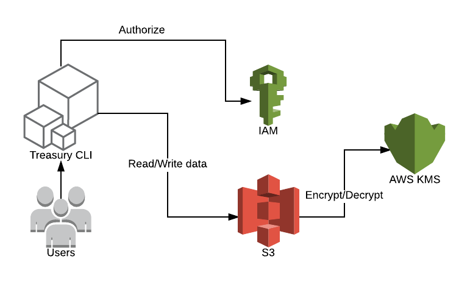

# treasury

Treasury is a very simple tool for managing secrets. It uses Amazon S3 service to store secrets. The secrets are encrypted before saving them on disks in their data centers and decrypted when we read the secrets. Treasury uses Server-Side Encryption.

## Architecture



## Command Line interface (CLI)

Treasury is controlled via a very easy to use command-line interface (CLI). Treasury is only a single command-line application: treasury. This application takes a subcommand such as "read", "write" and "export".

The Treasury CLI is a well-behaved command line application. In erroneous cases, a non-zero exit status will be returned. It also responds to -h and --help as you'd most likely expect.

To view a list of the available commands at any time, just run `treasury` with no arguments. To get help for any specific subcommand, run the subcommand with the -h argument.

** TO DO: add homebrew for cli install **

### Requirements

* Export environment variables: treasury S3 bucket and region (environment variable or --region parameter) set

  For example:
  ```
  export TREASURY_S3=st-treasury-st-staging
  export AWS_REGION=eu-west-1
```

* AWS Credentials

  Before using the Treasury CLI, ensure that you've configured AWS credentials. The best way to configure credentials on your machine is to use the ~/.aws/credentials file, which might look like:

  ```bash
  [default]
  aws_access_key_id = AKID1234567890
  aws_secret_access_key = MY-SECRET-KEY
```

  Alternatively, you can set the following environment variables:

  ```bash
  AWS_ACCESS_KEY_ID=AKID1234567890
  AWS_SECRET_ACCESS_KEY=MY-SECRET-KEY
  ```
  You can also use non-default awscli profile:

  `AWS_PROFILE=st-staging treasury read integration/webapp/cockpit_api_pass`

  And non-default awscli profile without default region:

  `AWS_PROFILE=st-staging ./treasury --region eu-west-1 read test/webapp/cockpit_pass`


### CLI Usage

#### Write secret
```
> treasury write integration/webapp/cockpit_api_pass superSecretPassword
Success! Data written to: webapp/integration/cockpit_api_pass
```

#### Read secret:
```
> treasury read integration/webapp/cockpit_api_pass
superSecretPassword
```

#### Export secrets:
Assuming stored secrets pairs on s3
```bash
integration/webapp/key1 => superSecretPassword1
integration/webapp/key2 => superSecretPassword2
```

To see exported values:
```bash
> treasury read integration/webapp/
export key1=superSecretPassword1
export key2=superSecretPassword2
```

To export them into shell environment variables:
```bash
eval $(treasury export integration/webapp/)
```

## Go Client

Example:
```go
import "github.com/AirHelp/treasury/client"

// use default client options
treasuryOptions := client.Options{}
treasury, err := client.NewClient(treasuryURL, treasuryOptions)
if err != nil {
  return err
}
secret, err := treasury.Read(key)
if err != nil {
  return err
}

fmt.Println(secret.Value)
```

** TO DO: add terraform resource **


## Development

## Build for development

```
make build
```

## Tests

Go tests

```
make test
```

Bats tests

```
bats test/bats/tests.bats
```

If `bats` missing, install it:
```bash
brew install bats
```
