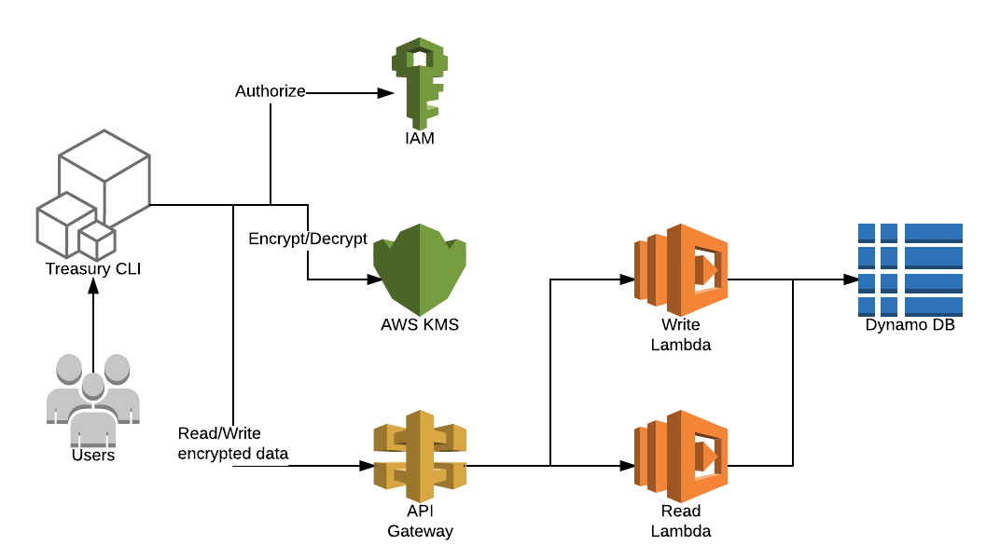

# treasury

Treasury is a very simple and easy to use tool for managing secrets. It uses AWS Key Management Service (KMS) for encrypting and decrypting secret values and master-key storage, and DynamoDB for encrypted secrets storage.

## Architecture



## Command Line interface (CLI)

Treasury is controlled via a very easy to use command-line interface (CLI). Treasury is only a single command-line application: treasury. This application then takes a subcommand such as "read" or "write".

The Treasury CLI is a well-behaved command line application. In erroneous cases, a non-zero exit status will be returned. It also responds to -h and --help as you'd most likely expect.

To view a list of the available commands at any time, just run `treasury` with no arguments. To get help for any specific subcommand, run the subcommand with the -h argument.

** TO DO: add homebrew for cli install **

### Requirements

* Treasury API URL over environment variable

For example:
```
export TREASURY_URL=https://zywdb8nrhf.execute-api.eu-west-1.amazonaws.com/dev
```

* AWS Credentials

Before using the Treasury CLI, ensure that you've configured credentials. The best way to configure credentials on your machine is to use the ~/.aws/credentials file, which might look like:

[default]
aws_access_key_id = AKID1234567890
aws_secret_access_key = MY-SECRET-KEY

Alternatively, you can set the following environment variables:

AWS_ACCESS_KEY_ID=AKID1234567890
AWS_SECRET_ACCESS_KEY=MY-SECRET-KEY

### CLI Usage

Write secret
```
> treasury write integration/webapp/cockpit_api_pass superSecretPassword
Success! Data written to: webapp/integration/cockpit_api_pass
```

Read secret:
```
> treasury read integration/webapp/cockpit_api_pass
superSecretPassword
```


## Go Client

Example:
```go
import "github.com/AirHelp/treasury/client"

// use default client options
treasuryOptions := client.Options{}
treasury, err := client.NewClient(treasuryURL, treasuryOptions)
if err != nil {
  return err
}
secret, err := treasury.Read(key)
if err != nil {
  return err
}

fmt.Println(secret.Value)
```

## API Gateway & Lambda

The Treasury HTTP API has been build on AWS API Gateway and AWS Lambda services. The API gives you access to Treasury via HTTP but it returns only encrypted secrets. The Treasury CLI uses the HTTP API to access Treasury storage.

All API routes are prefixed with /v1/.

** TO DO: add authentication over AIM **

### Deployment

The serverless cli is required for API Gateway & Lambda deployment.

```
npm install -g serverless
```

Deployment:

```
cd lambda && sls deploy -v
```

### Usage example

Read secret
```
$ curl -s -XGET https://zywdb8nrhf.execute-api.eu-west-1.amazonaws.com/dev/v1/secret?key=webapp/integration/cockpit_api_pass | jq .
{
  "version": 1484216745.431677,
  "kms_arn": "arn:aws:kms:eu-west-1:064764542321:key/14b4a163-6c9d-4edb-a4bf-5adc4cd50ad8",
  "value": "base64EncryptedBlob",
  "key": "webapp/production/cockpit_api_user",
  "author": "Krzysztof"
}
```

Write secret
```
$ curl -s -XPOST -H "Content-Type: application/json" -d '{"key": "webapp/production/cockpit_api_user","value": "base64EncryptedBlob","kms_arn": "arn:aws:kms:eu-west-1:064764542321:key/14b4a163-6c9d-4edb-a4bf-5adc4cd50ad8","author": "Krzysztof"}' https://zywdb8nrhf.execute-api.eu-west-1.amazonaws.com/dev/v1/secret | jq .
{
  "message": "Success! Data written to: webapp/production/cockpit_api_user"
}
```

## DynamoDB

DynamoDB as a backend storage is responsible for durable storage of encrypted data.

DynamoDB table can be created via serverless resource:

```
resources:
  Resources:
    usersTable:
      Type: AWS::DynamoDB::Table
      Properties:
        TableName: treasury
        AttributeDefinitions:
          - AttributeName: key
            AttributeType: S
          - AttributeName: version
            AttributeType: N
        KeySchema:
          - AttributeName: key
            KeyType: HASH
          - AttributeName: version
            KeyType: RANGE
        ProvisionedThroughput:
          ReadCapacityUnits: 1
          WriteCapacityUnits: 1
```

** TO DO: add terraform resource **
